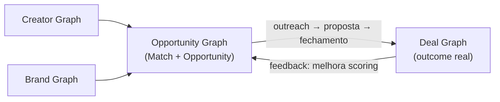

# Context map

> Como os domínios/graphs se relacionam. Modelagem de entidades detalhada fica em [`../domains/`](../domains/); a visão de produto por trás desses graphs está em [`../product/vision.md`](../product/vision.md#product-graph).

## Os quatro graphs

- **Creator Graph** ([`../domains/creator.md`](../domains/creator.md)) e **Brand Graph** ([`../domains/brand.md`](../domains/brand.md)) são os dois insumos de entrada — descrevem, respectivamente, o creator e a marca.
- **Opportunity Graph** ([`../domains/opportunity.md`](../domains/opportunity.md)) cruza os dois anteriores e produz Match e Opportunity.
- **Deal Graph** ([`../domains/deal.md`](../domains/deal.md)) registra o outcome real quando uma Opportunity avança até negociação/fechamento, e retroalimenta o Opportunity Graph — este é o loop do [flywheel](../product/vision.md#north-star-e-flywheel).

## Fronteiras entre domínios

- Creator e Brand são domínios relativamente independentes entre si — não há dependência direta de um sobre o outro.
- Opportunity depende de dados de Creator e Brand, mas não os modifica (leitura).
- Deal depende de uma Opportunity ter existido antes — não se cria um Deal sem uma Opportunity de origem.
- O feedback de Deal para Opportunity (melhorar scoring) é um mecanismo ainda não definido — ver "Feedback loop" em [`../product/intelligence/matchmaking.md`](../product/intelligence/matchmaking.md).

## Domínios futuros (não modelados)

Campaign, Content, Operations e Venture ainda não têm relação definida com os quatro graphs acima — ver nota em [`overview.md`](overview.md#domínios).
